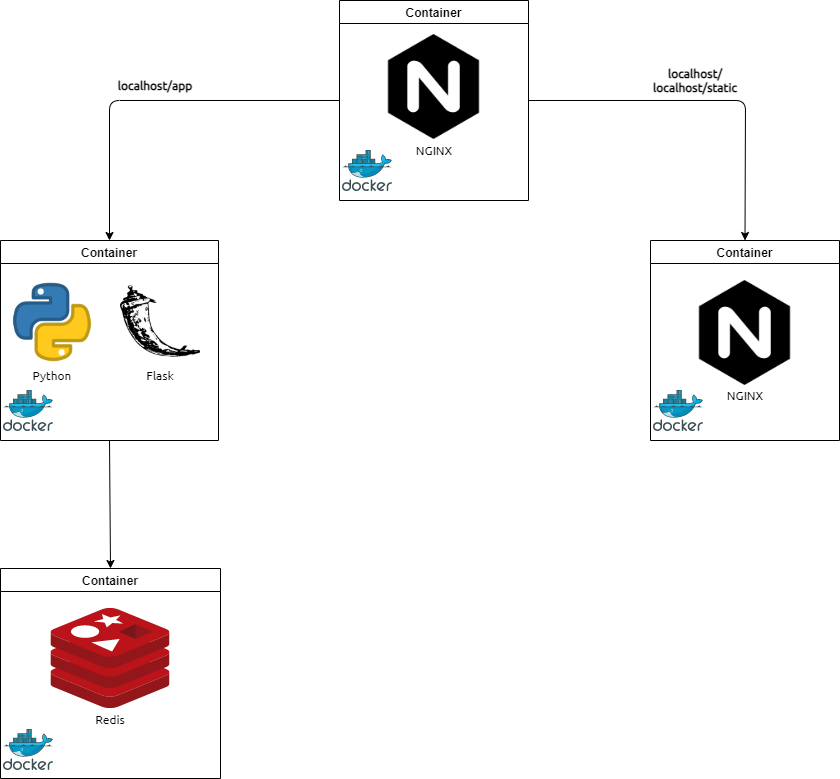

# Nginx Proxy Demo with Docker

## About this application
This project will run 4 containers

* Nginx container (to proxy requests)
* Nginx container (to serve static content)
* Python Flask container
* Redis (behind the Python Flask container)
## Architecture Diagram


## Prerequisites
 * [Docker](https://docs.docker.com/get-docker/ "Install Docker")

 ## Clone the application

 ```shell
 git clone https://github.com/Varshit07/docker-nginx-proxy.git
 ```

## Running the application containers

```shell
docker-compose up --build
```

## Stopping the application containers

```shell
docker-compose up --down
```
